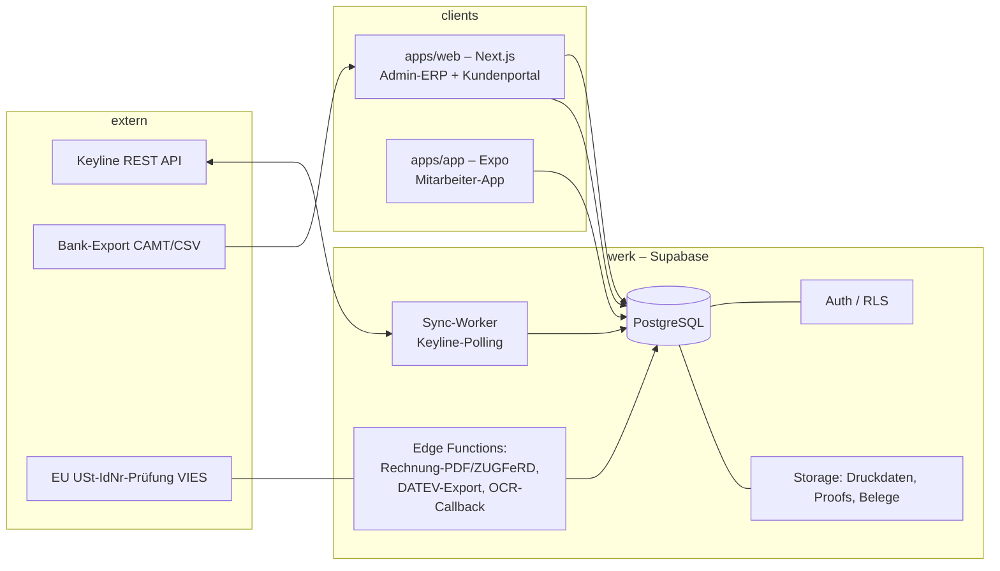

# werk — Architektur

Zentrale Datenbasis für die Druckerei: ERP-Kern, vorbereitende Buchhaltung,
Mitarbeiter-App und Kundenportal. Ein System, eine Datenbank, mehrere Oberflächen.

Stand: 2026-08-28 · Slice 1 (Fundament)

---

## 1. Grundprinzipien

1. **Eine Datenbasis.** Alles liegt in *einer* PostgreSQL-Datenbank (Supabase).
   Portal, App und Buchhaltung sprechen nur mit dieser DB, nie direkt mit Keyline.
2. **Keyline bleibt, aber entkoppelt.** Keyline ist weiterhin das Kalkulations- und
   Auftrags-Werkzeug für individuell kalkulierte Druckaufträge (Offset-Erbe: Nutzen,
   Falzschema). Ein Sync-Worker spiegelt Keyline-Daten in unsere DB. Dadurch ist
   Keyline jederzeit austauschbar und wir besitzen immer eine eigene Kopie.
3. **Wire-O im eigenen System.** Der Shop verkauft ausschließlich Wire-O-gebundene
   Produkte mit Mengenstaffel. Kalkulation als einfaches parametrisches Kostenmodell
   → materialisierte Preismatrix (Hybrid: gerechnet + manuell überschreibbar).
4. **Fakturierung führend im eigenen System.** *Alle* Kundenrechnungen entstehen hier
   — ein lückenloser Nummernkreis, eine OP-Verwaltung, ein DATEV-Export.
5. **Code + Migrationen statt Klick-Logik.** Schema als versionierte SQL-Migrationen
   im Repo. Struktur­änderungen sind billig und nachvollziehbar.
6. **EU-Hosting.** Supabase Region Frankfurt. DSGVO: AV-Vertrag, Löschkonzept.

---

## 2. Systemüberblick

---

## 3. Bausteine

| Baustein | Technik | Zweck |
|---|---|---|
| `packages/db` | Supabase (Postgres 15+), SQL-Migrationen, `supabase` CLI | Schema, RLS, Seed, generierte Typen |
| `packages/shared` | TypeScript | geteilte Typen, Steuer-/Preislogik, Konstanten |
| `apps/web` | Next.js (App Router), Vercel/Hetzner | Admin-ERP **und** Kundenportal (getrennte Route-Groups, gleiche Codebasis) |
| `apps/app` | Expo / React Native | Mitarbeiter-App: Zeiterfassung, Auftragsstatus, Barcode, Beleg-Scan |
| `services/sync` | Node-Worker (Cron) | pollt Keyline + Ninox, schreibt nach Supabase; Xano-Einmalimport |
| Auth | Supabase Auth (E-Mail/Passwort, Magic Link) | eine Identität für Mitarbeiter *und* Kundenkontakte |
| Storage | Supabase Storage (S3-kompatibel) | Druckdaten, Proofs, Beleg-Scans, Rechnungs-PDF/XML |
| Edge Functions | Deno | Rechnungs-PDF + ZUGFeRD, DATEV-Datei, VIES-Prüfung, OCR-Callback |

### Umgebungen

| Umgebung | Supabase-Projekt | Zweck |
|---|---|---|
| dev | `werk-dev` | Entwicklung, `supabase db reset` mit Seed |
| prod | `werk-prod` | Echtbetrieb, nur Migrationen, tägliche Backups (Pro-Plan) |

Secrets ausschließlich über Umgebungsvariablen / Supabase Vault, nie im Repo
(siehe `.env.example`). Der Keyline-API-Key hat Vollzugriff auf das Keyline-Konto —
nur im Worker, nie im Browser/Client.

---

## 4. Datenflüsse

### 4.1 Fremdsysteme → werk (Spiegelung)

- **Verfahren:** Polling (Keyline hat keine Webhooks). Der Worker fragt je
  Fremdsystem + Ressource mit Datumsfilter „geändert seit `last_cursor`" ab.
  Status in `external_sync_state` (`system`, `resource`).
- **Keyline-Ressourcen:** `customer_relations/organizations`, `sales/orders`,
  `production/products` + `production/tasks`, `accounting/customer_invoices`,
  `accounting/credit_notes`, `logistics/shipments`.
- **Ninox:** Kunden des Kalender-Vertriebs (`customer_segment = 'kalender'`).
- **Xano:** einmaliger Import des Firmen-Altbestands, danach abgeschaltet.
- **Richtung:** überwiegend **einweg** (Fremdsystem → werk). Rückschreiben nur, wo
  werk führend ist (siehe Matrix) und das Fremdsystem die Daten braucht — z. B.
  eine im Shop entstandene Bestellung als bestätigter Auftrag nach Keyline.
- **Mapping:** `organization_external_ref` (`system`, `external_id`,
  `is_authoritative`) je Organisation; transaktionale Spiegel-Tabellen
  (`order`, `invoice`, …) tragen `keyline_id`. Konflikte nach Hoheits-Matrix;
  bei „Fremdsystem führend" gewinnt das Fremdsystem.

### 4.2 Wire-O-Bestellung

Portal-Konfigurator → `price_matrix`-Lookup → `quote` (optional) → `order`
(`type = 'shop'`) → `production_job` (Statuskette Prepress → Druck → Kaschieren →
Bohren → Wire-O → Versand) → `invoice`.

### 4.3 Fakturierung & OP

`order` (Shop **oder** aus Keyline gespiegelt) → `invoice` (Entwurf) →
**Festschreibung**: Nummer aus `next_number('invoice')`, ab jetzt unveränderlich →
PDF + ZUGFeRD/XRechnung (Edge Function) → Versand.
Zahlungseingang: `payment` → `payment_allocation` auf eine oder mehrere `invoice`.
Bank-Import (CAMT/CSV) → `bank_transaction` → Vorschlag → Zuordnung.
Überfällig → `dunning_run` → `dunning_notice` (Stufe 1–3, Gebühr, Zinsen).

### 4.4 Vorbereitende Buchhaltung & DATEV

Eingangsbeleg (Foto aus App / Upload) → `incoming_document` mit OCR-Vorschlag →
Prüfung/Kontierung (SKR03-Konto + Kostenstelle + Steuerschlüssel) →
`datev_export`: Buchungsstapel (EXTF-CSV) für Debitoren-Rechnungen, Zahlungen und
Eingangsbelege + Stammdaten-Export Debitoren/Kreditoren. Jeder Export wird als
unveränderlicher Datensatz mit Datei-Hash protokolliert.

### 4.5 Zeiterfassung (gesetzlich)

App/Terminal → `time_entry` (Kommen/Gehen) + `break_entry`. Tagesabschluss →
`time_day_summary` (Soll/Ist/Saldo). Korrekturen nach Abschluss nur als
`time_correction` (angehängt, auditiert) — der ursprüngliche Datensatz bleibt
erhalten. Abwesenheiten über `absence` (Antrag → Genehmigung), Urlaubskonto in
`vacation_account`.

---

## 5. Hoheits-Matrix (Source of Truth)

| Entität | Führend | werk-Rolle |
|---|---|---|
| Kunden **Akzidenz** (`customer_segment='akzidenz'`) | **Keyline** | Spiegel (read); Portal-Zugang, Preisgruppe, Segment ergänzend in werk |
| Kunden **Kalender** (`customer_segment='kalender'`) | **Ninox** (Kalender-Vertrieb) | Spiegel (read) |
| Firmen-Altbestand | **Xano** | einmaliger Import → danach werk |
| Lieferanten | **werk** | — (in keinem Fremdsystem) |
| Sonderauftrag (Angebot/Auftrag) | **Keyline** | Spiegel (read) |
| Wire-O-Produkte, Kostenparameter, Preismatrix | **werk** | — |
| Shop-Bestellung | **werk** | optional Push nach Keyline für Produktion |
| Produktion Sonderauftrag | **Keyline** | Statusspiegel |
| Produktion Wire-O | **werk** | — |
| **Versand** (Lieferschein, Packstücke, Tracking) | **werk** | — |
| **Alle Kundenrechnungen** | **werk** | Keyline-Rechnungen werden gespiegelt, in werk *nicht* neu erzeugt; künftig ausschließlich werk |
| Zahlungen / OP / Mahnwesen | **werk** | — |
| Eingangsbelege / Kreditoren | **werk** | — |
| Einkauf / Material / Bestand | **werk** | — |
| Mitarbeiter / Zeiterfassung / Abwesenheit | **werk** | — |
| Sachkonten / Steuerschlüssel / DATEV-Export | **werk** | Kontenverwaltung im Admin-ERP |

Übergangsphase: Bestandsrechnungen aus Keyline laufen dort weiter aus; neue
Rechnungen entstehen ab Einführung des Fakturierungs-Moduls nur noch in werk.

---

## 5a. Kundenstammdaten-Konsolidierung

Der Kundenbestand liegt heute in drei Systemen. Ziel: **eine** `organization`-Tabelle.

| Quelle | Inhalt | nach Import führend |
|---|---|---|
| Keyline | Akzidenzkunden (+ Debitorennummern) | Keyline (laufender Sync) |
| Ninox | Kunden Kalender-Vertrieb | Ninox (laufender Sync) |
| Xano | Firmen-Altbestand | werk (Xano wird abgeschaltet) |

Vorgehen:
1. Je Quelle ein Import-Lauf → `organization` + `organization_external_ref`
   (`system`, `external_id`, `is_authoritative`).
2. **Dublettenabgleich**: primär über USt-IdNr, sekundär Name + PLZ. Treffer
   werden zusammengeführt; `customer_segment` wird `mixed`, wenn ein Kunde in
   Akzidenz *und* Kalender existiert.
3. **Debitorennummer** kommt aus Keyline; Kunden ohne Keyline-Datensatz bekommen
   eine neue aus `next_number('customer_number')` (Bereich ab 10000).
4. Nach Abschluss: Xano-Ref bleibt zur Nachvollziehbarkeit, `is_authoritative`
   steht auf `werk`.

Offen: gibt es eine „Leit-Liste", die bei Konflikten immer gewinnt? (siehe
[datenmodell.md](datenmodell.md) Offene Punkte)

---

## 6. Rollen & Berechtigungen (RLS)

Row Level Security ist auf **allen** Tabellen aktiv. Durchsetzung in der Datenbank,
nicht in der Anwendung.

| Rolle | Umfang |
|---|---|
| `admin` | alles, inkl. Konfiguration, Kontenverwaltung, Nummernkreise, DATEV-Einstellungen |
| `office` | Stammdaten, Angebote, Aufträge, Produktion |
| `accounting` | Fakturierung, Zahlungen, Mahnwesen, Eingangsbelege, Konten/Steuerschlüssel, DATEV |
| `production` | Produktionsstatus, Zeiterfassung-Verwaltung, Material |
| `shipping` | Versand: Kommissionierung, Lieferscheine, Versandlabels, Tracking (Mitarbeiter, `is_staff`) |
| `employee` | Mitarbeiter-App: **eigene** Zeiten/Abwesenheiten, zugewiesene Aufträge, Belege erfassen |
| `customer` | Kundenportal: **nur die eigene Organisation** (Angebote, Aufträge, Rechnungen, Dateien) |
| `supplier` | Lieferantenportal (Slice 8): **nur die eigene Organisation** (Bestellungen, Eingangsrechnungen hochladen) |

Hilfsfunktionen in der DB: `has_role()`, `has_any_role()`, `is_staff()`,
`customer_org_ids()`. Der Sync-Worker und serverseitige Jobs nutzen den
`service_role`-Key und umgehen RLS bewusst.

---

## 7. Revisionssicherheit (GoBD)

- **Audit-Log** (`audit_log`): Trigger auf allen buchführungs-relevanten Tabellen,
  speichert Vorher/Nachher als JSON inkl. Akteur.
- **Festschreibung:** Rechnungen erhalten ihre Nummer erst bei Festschreibung und
  sind danach unveränderlich. Korrektur nur über Storno + neue Rechnung.
- **Nummernkreise** (`number_sequence` + `next_number()`): lückenlos, mit
  Zeilensperre, optional Jahres-Reset.
- **Adress-Snapshot:** Rechnungen frieren Rechnungsadresse und Zahlungsbedingungen
  als JSON ein.
- **DATEV-Exporte** werden mit Zeitraum, Zeilenzahl und Datei-Hash protokolliert.
- **Aufbewahrung:** 8–10 Jahre; kein Hard-Delete auf belegführenden Tabellen
  (Status `cancelled` statt Löschung). Verfahrensdokumentation separat pflegen.

---

## 8. Steuerlogik

| Fall | `tax_treatment` | Wirkung |
|---|---|---|
| Inland | `standard_de` | 19 % / 7 % USt |
| EU B2B mit gültiger USt-IdNr | `reverse_charge_eu` | 0 %, Hinweis „Steuerschuldnerschaft des Leistungsempfängers", Zusammenfassende Meldung (ZM) |
| EU-Warenlieferung B2B | `intra_community_supply` | steuerfrei, Nachweis + ZM |
| Schweiz (Drittland) | `export_third_country` | steuerfreie Ausfuhrlieferung, Ausfuhrnachweis |

USt-IdNr wird gegen VIES geprüft (`vat_id_valid`, `vat_id_checked_at`).
Rechnungswährung vorerst **immer EUR**, auch für die Schweiz (CHF nachrüstbar).
Konten- und Steuerschlüssel-Zuordnung ist ein Vorschlag und wird mit dem
Steuerberater bestätigt.

---

## 9. Bau-Reihenfolge (Slices)

Teure/unsichere Bereiche zuerst, solange Umbau billig ist.

| Slice | Inhalt | Status |
|---|---|---|
| **1** | Fundament: Auth/Rollen/RLS, Stammdaten-Kern, `organization_external_ref`, Steuer- & Nummernkreis-Basis, Audit-Log, Sync-Status | **dieser Stand** |
| 1b | Admin-ERP-Grundgerüst + **Kontenverwaltung** (Sachkonten, Steuerschlüssel, Kostenstellen, Nummernkreise, Firmenprofil) | offen |
| 2 | Sync-Worker: Keyline (Organisationen + Sonderaufträge) und Ninox (Kalenderkunden) spiegeln; Xano-Einmalimport; Dublettenabgleich | offen |
| 3 | Fakturierung + OP: Rechnung, Festschreibung, PDF/ZUGFeRD, Zahlungen, Mahnwesen | offen |
| 4 | Vorbereitende Buchhaltung: Eingangsbelege + OCR, DATEV-Export | offen |
| 5 | Wire-O-Shop: Produkte, Optionsliste, Kostenmodell, Preismatrix | offen |
| 6 | Kundenportal: Angebote/Aufträge/Rechnungen, Datei-Upload, Proof-Freigabe, Konfigurator | offen |
| 7 | Mitarbeiter-App: Zeiterfassung, Abwesenheit, Auftragsstatus, Barcode, Beleg-Scan | offen |
| 8 | Einkauf & Material, Versand, Produktion Wire-O, Lieferantenportal, Reporting | offen |
| 9 | Webshop-Frontend auf Basis der Preismatrix | später |

---

## 10. Offene Punkte

Siehe [aenderungsliste.md](aenderungsliste.md). Nach Runde 1 noch offen:

1. Dublettenstrategie für die Stammdaten-Konsolidierung (§5a)
2. SKR03-Konten/Steuerschlüssel + DATEV-Stammdaten mit dem Steuerberater
3. Versand-Umfang (Teillieferungen / Packstücke?) — Detail für Slice 8
4. Sammelrechnung-Rhythmus, Abschlagsrechnung-Bezug — Detail für Slice 3
